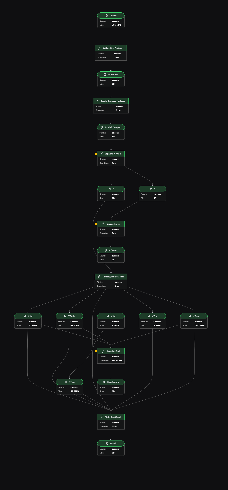

# Spaceship Titanic -- MLOps Project

A **production-ready**, **modular**, and **reproducible** ML pipeline for the [Spaceship Titanic](https://www.kaggle.com/competitions/spaceship-titanic/) challenge, built with **Kedro** and **MLflow** following MLOps best practices.

---

## 🚀 Goal

End-to-end ML workflow:
- Data ingestion & cleaning  
- Feature engineering (including grouped features)  
- Deterministic train/val/test split  
- Bayesian hyperparameter optimization  
- Train best model & persist artifacts  
- Full experiment tracking with MLflow  
- Modular orchestration with Kedro

**Target:** Predict the binary label `Transported`.

---

## 🛠️ Tech Stack

- **Kedro** -- orchestration, data catalog, parameterization  
- **MLflow** -- experiment tracking, metrics, artifacts  
- **pandas**, **numpy** -- data manipulation  
- **optuna** -- Bayesian optimization
- **scikit-learn** -- modeling & evaluation  
- **pre-commit** -- code formatting & linting  
- **pytest** -- testing

---

## 🧭 Pipeline Overview

1. **Df Raw** → ingest CSV  
2. **Adding New Features** → create base features  
3. **Df Refined** → clean & filter  
4. **Create Grouped Features** → aggregations (e.g., cabin/deck)  
5. **Df With Grouped** → merge grouped features  
6. **Separate X and Y** → split features/target  
7. **Casting Types** → type casting for categorical/numeric  
8. **Splitting Train Val Test** → deterministic splits  
9. **Bayesian Opti** → hyperparameter search  
10. **Best Params** → store best parameters  
11. **Train Best Model** → final training  
12. **Model** → serialize model (pickle/joblib)  
13. **X_test / y_test** → final evaluation

---

## ⚙️ Installation

> Requires Python 3.10+

~~~bash
# 1) Clone repo
git clone <your_repo>
cd <your_repo>

# 2) Create environment
python -m venv .venv
source .venv/bin/activate   # Windows: .venv\Scripts\activate

# 3) Install
pip install -U pip
pip install -e .

# 4) Optional: code quality hooks
pre-commit install
~~~

---

## 🗃️ Data

Place `train.csv` and `test.csv` from Kaggle in `data/01_raw/`.  
The **catalog.yml** defines datasets and their locations, e.g.:

~~~yaml
raw_spaceship:
  type: pandas.CSVDataSet
  filepath: data/01_raw/train.csv

df_refined:
  type: pandas.ParquetDataSet
  filepath: data/02_intermediate/df_refined.parquet
~~~

---

## 🔧 Parameters

Defined in `conf/base/parameters.yml` (override locally in `conf/local/parameters.yml`):

~~~yaml
split:
  test_size: 0.15
  val_size: 0.15
  random_state: 42

model:
  estimator: RandomForestClassifier
  n_estimators: 500
  class_weight: balanced

opt:
  n_trials: 40
  metric: roc_auc
~~~

---

## ▶️ Running the Pipeline

### Run full pipeline
~~~bash
kedro run
~~~

### Run a specific sub-pipeline
~~~bash
kedro run --pipeline=data
kedro run --pipeline=modeling
~~~

### Visualize DAG
~~~bash
kedro viz
~~~

---

## 🧪 Experiment Tracking (MLflow)

Each run logs parameters, metrics (e.g., ROC AUC), and artifacts.

Launch MLflow UI locally:
~~~bash
mlflow ui --backend-store-uri mlruns
# Open http://127.0.0.1:5000
~~~

---

## 📈 Evaluation & Metrics

- Default metrics: `roc_auc`, `accuracy`, `precision`, `recall`, `f1`  
- Confusion matrices and ROC/PR curves can be saved as artifacts  
- Validation metrics drive optimization; test is held out for final scoring

---

## 🔍 Hyperparameter Optimization

- Bayesian optimization guided by `opt.metric`  
- Best parameters stored and used for final training  
- Number of trials configured in `parameters.yml`

---

## ✅ Quality & Tests

~~~bash
# Lint/format
pre-commit run -a

# Unit tests
pytest -q
~~~

---

## 🔐 Local Config

`conf/local/` can contain:
- `catalog.yml` (local paths)
- `parameters.yml` (local overrides)
- `credentials.yml` (encrypted if needed)

All files in `conf/local/` should be gitignored.

---

## 🧭 Roadmap

- [ ] MLflow **Model Registry** with stages (Staging/Production)  
- [ ] Containerization (Docker) + inference API deployment

---

## 🙏 Acknowledgements

- Dataset: Kaggle -- Spaceship Titanic  
- Tools: Kedro, MLflow, scikit-learn, pandas

---

## Notes

- Everything is configurable via `conf/*`.  
- If you switch the estimator (e.g., XGBoost/LightGBM), update `parameters.yml` and the `Train Best Model` node accordingly.  
- Node/dataset naming mirrors the DAG for clarity.
